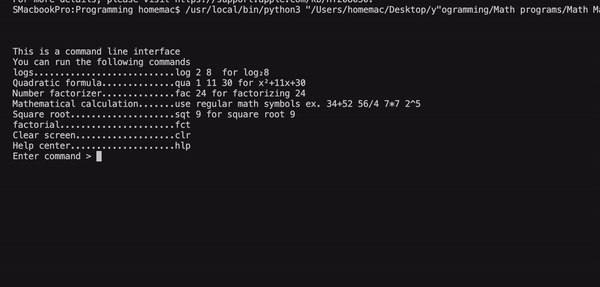
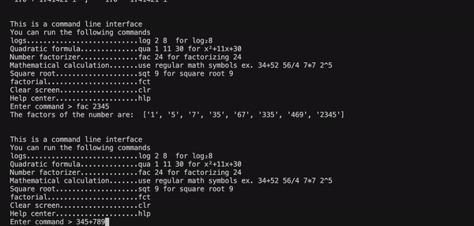

# math-codes
Series of math codes
# Master math calculator:

# Quadratic formula
 - Quadratic formula calculator, can process imaginary number solutions
 - Enter a,b,c, will generate detected equation and solutions
# Factorizer
 - Number factorizer, can prime factorize any rational number
# Synthetic division
 - Synthetic division calculator, can divide a polynomial by a binomial
 - generates numbers properly, but does not format properly
# Rational remainder theorem
 - Rational remainder theorem calculator, can find out the possible factors of a polynomial
# Log calculator
 - Log calculator, can calculate logs
# Trig calculator
 - Trig calculator, can calculate sin, cos, tan, csc, sec, and cot trignometric ratios
 - Is not generating accurate values right now (I have opened an issue)
# Graphing calc
 - Basic graphing calculator, can process only constant and linear functions, generates table of values and graph in shell using text output
# Advanced graphing calc
 - More advanced graphing calculator, can process constant, linear, quadratic, cubic, and quintic functions, generates table of values and graph in graphics using multiple colors
